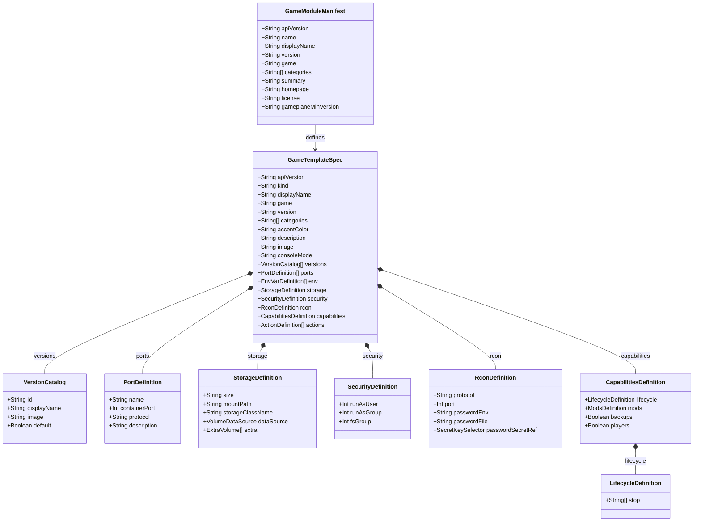
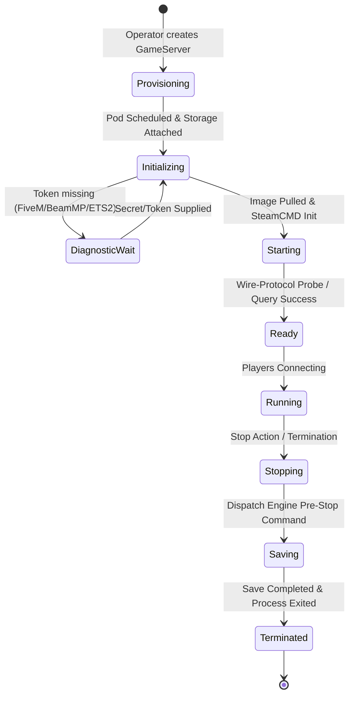

# Data Model: Dedicated Server Modules for Top Steam Games

**Feature**: `015-top-steam-game-modules`  
**Date**: 2026-09-03 (refreshed 2026-10-09)  
**Status**: Completed  

---

## 1. Entity Architecture Overview

The Gameplane module system structures dedicated game servers into standardized Kubernetes Custom Resources (`GameTemplate`), package manifests (`module.yaml`), architecture specifications (`specs.md`), and operational instances (`GameServer`).

---

## 2. Entity Field Specifications

### 2.1 `GameModuleManifest` (`module.yaml`)
Defined under `.schema/module.schema.json`:

| Field | Type | Required | Description | Example |
|---|---|---|---|---|
| `apiVersion` | string | Yes | Module API version | `gameplane.local/module/v1` |
| `name` | string | Yes | Unique kebab-case module slug | `team-fortress-2` |
| `displayName` | string | Yes | Human-readable game title | `Team Fortress 2` |
| `version` | string | Yes | Semver module revision | `1.0.0` |
| `game` | string | Yes | Canonical game identifier | `tf2` |
| `categories` | string[] | No | Genre and playstyle tags | `[Shooter, PvP, Class-Based]` |
| `summary` | string | Yes | Short one-line summary | `Team Fortress 2 dedicated server (Source Engine)` |
| `homepage` | string | No | Official game or community URL | `https://www.teamfortress.com` |
| `license` | string | No | Module metadata license | `MIT` |
| `gameplaneMinVersion` | string | No | Minimum compatible Gameplane version | `0.2.0-beta.7` |

---

### 2.2 `GameTemplate` Spec (`template.yaml`)
Defined under `.schema/gametemplate.schema.json`:

| Field | Type | Required | Description |
|---|---|---|---|
| `spec.displayName` | string | Yes | Human-readable template name |
| `spec.game` | string | Yes | Target game identifier matching `module.yaml` |
| `spec.version` | string | Yes | Template semver |
| `spec.image` | string | Yes | Default fallback container image with `@sha256:` digest |
| `spec.categories` | string[] | No | List of category classifications |
| `spec.accentColor` | string | No | Hex color code for UI cards (e.g. `#BD3B3B`) |
| `spec.description` | string | No | Markdown description of server capabilities |
| `spec.versions` | Version[] | No | Curated array of selectable version images with digest pins |
| `spec.ports` | Port[] | No | Named port definitions with `UDP` or `TCP` protocol |
| `spec.env` | EnvVar[] | No | Configurable environment variables and defaults |
| `spec.storage` | Storage | No | Persistent volume mount point (`size`, `mountPath`, `storageClassName`, `dataSource`, `extra`) |
| `spec.security` | Security | No | User UID, GID, and filesystem permissions matching image (`runAsUser`, `runAsGroup`, `fsGroup`) |
| `spec.consoleMode` | string | No | Dashboard console transport: `rcon`, `pty` (pod-attach to stdin), or `none`. `rcon` requires `spec.rcon.protocol` other than `none` (CEL rule) |
| `spec.rcon` | Rcon | No | RCON protocol (see §2.3), port, and credential source (`passwordEnv`, `passwordFile`, or `passwordSecretRef`) |
| `spec.capabilities`| Caps | No | Supported features (mods, backups, player list, lifecycle) |
| `spec.capabilities.lifecycle.stop` | string[] | No | Pre-stop command sequence (1-16 command strings) for graceful world saves |

### 2.3 `spec.rcon.protocol` Values

Enum at `operator/api/v1alpha1/gametemplate_types.go:1006`, mirrored in `modules/.schema/gametemplate.schema.json` and `modules/validate.py` `RCON_PROTOCOLS`. This feature added `rest` and `cli` (research.md Decision 6).

| Value | Agent client | Used by (shipped) |
|---|---|---|
| `source` | `rcon.go` (Source RCON) | cs2, project-zomboid, team-fortress-2, ark-survival-ascended, left-4-dead-2, factorio, the-isle, ark-survival-evolved, hell-let-loose, squad |
| `websocket` | `websocket.go` | rust |
| `battleye` | `battleye.go` | dayz |
| `telnet` | `telnet.go` | none in this feature |
| `palworld` | `palworld.go` | palworld |
| `satisfactory` | `satisfactory.go` | satisfactory |
| `nuclearoption` | `nuclearoption.go` | outside this feature |
| `rest` | `rest.go` with `txadmin`, `farming-simulator-25`, `generic` adapters | fivem, farming-simulator-25 |
| `cli` | `cli.go` (writes to the stdin FIFO at `-cli-pipe`) | none yet |
| `none` | no client | euro-truck-simulator-2, garrys-mod, mount-and-blade-2-bannerlord, terraria, 7-days-to-die, tmodloader, beammp, dont-starve-together, valheim, arma-reforger |

For a `cli` template with neither `passwordEnv` nor `passwordSecretRef`, the operator mints no `<gs>-rcon` Secret (`gameserver_rcon.go`), and the dashboard's `rconAvailable` returns false so live-RCON actions stay hidden (`web/src/lib/capabilities.ts`).

---

## 3. State Transitions & Lifecycle Invariants

### 3.1 Server Lifecycle State Machine

### 3.2 Invariants & Validation Rules

1. **Digest Immutability**: Every concrete version in `spec.versions` MUST specify an immutable image digest (`@sha256:...`).
2. **Mount Safety**: `spec.storage.mountPath` MUST NOT match or be an ancestor of the image's `ENTRYPOINT` or `CMD` executable path.
3. **SteamCMD User Invariant**: When `spec.security.runAsUser` is set, `spec.env` MUST include `HOME` pointing to a writable directory if not baked into the image.
4. **Pre-Stop Integrity**: When the engine supports persistence, `spec.capabilities.lifecycle.stop` must contain a valid world-save command sequence.
